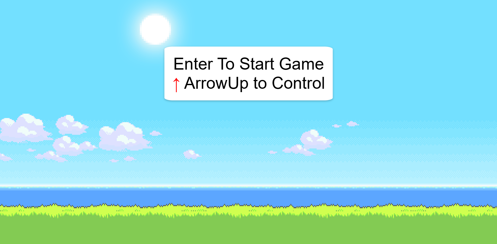
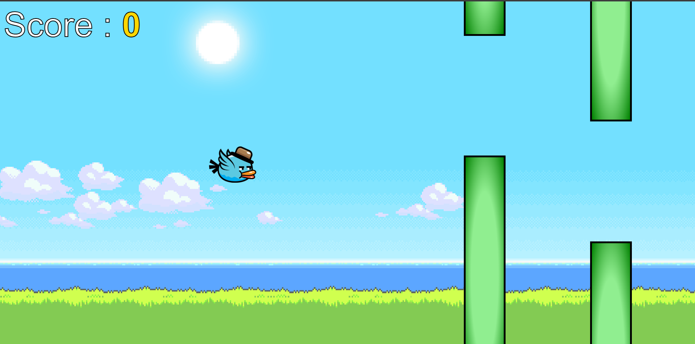
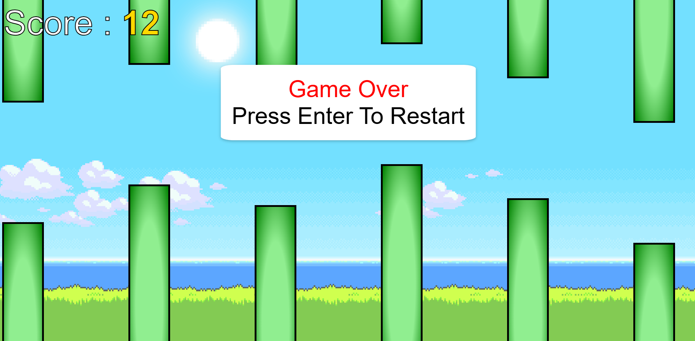

This project is a simple Flappy Bird game developed using HTML, CSS, and JavaScript.
The game runs directly in the browser without any external libraries.

The player controls a bird and tries to survive by keeping it within the game area using keyboard input.

## 📸 Screenshots

### Game Start

### Gameplay

### Game Over

🎮 How the Game Works

The bird is affected by gravity and continuously falls downward.

The player presses the Arrow Up (↑) key to make the bird jump upward.

The game starts when the player presses Enter.

The score increases as the game continues.

The game ends if the bird touches the top or bottom boundary.

🧱 Technologies Used

HTML5 – Game structure

CSS3 – Styling and layout

JavaScript (Vanilla JS) – Game logic and controls

No frameworks or libraries are used.

📁 Project Folder Structure
FlappyBird/
│
├── index.html
├── style.css
├── script.js
│
└── images/
    ├── Bird.png
    └── favicon.ico

⚠️ Note:

File names are case-sensitive

The images folder must exist

Bird.png name must match exactly

🧾 File Explanation
1️⃣ index.html

This file defines the game layout.
Main elements used:

Background container

Bird image

Instruction message

Score display

It also links:

style.css for styling

script.js for game logic

2️⃣ style.css

This file handles:

Game background styling

Bird positioning

Message and score display

Screen layout and alignment

CSS is used to give a clean and simple game appearance.

3️⃣ script.js

This file contains the main game logic:

Gravity effect

Bird movement

Keyboard controls

Score handling

Game start and game over logic

JavaScript runs continuously using a game loop.

⌨️ Game Controls
Action	Key
Start Game	Enter
Fly Up	Arrow Up (↑)
▶️ How to Run the Game

Download or clone the project

Ensure all files are in the correct folders

Open index.html in a modern browser (Chrome / Edge / Firefox)

Press Enter to start playing

❗ Common Issues & Fixes
Game not starting?

✔ Check if script.js is linked correctly
✔ Open browser console (F12) for errors

Bird image not visible?

✔ Check images/Bird.png exists
✔ File name case must match

Blank screen?

✔ Verify style.css path
✔ Make sure files are not empty

🎯 Learning Outcomes

After completing this project, you will understand:

Basic game loop in JavaScript

DOM manipulation

Keyboard event handling

Gravity and motion logic

Simple browser-based game development

🚀 Future Improvements

Add pipes (obstacles)

Add sound effects

Add pause and restart buttons

Add high score system

Mobile touch controls

👨‍💻 Author

Sahni Trirpurari Sureshbhai
SYBCA – Anand Commerce College
YouTube: SahniCodeClub
